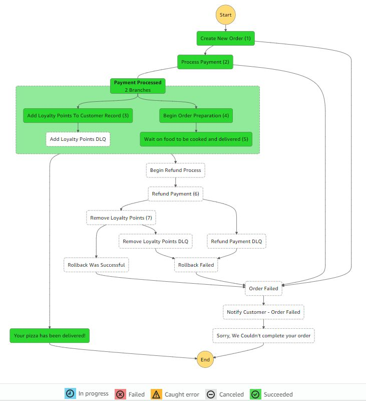

# AWS Step Functions sample project

This project uses the AWS CDK to deploy a state machine that simulates an online pizza ordering process.  

 <br /> 

## To get started:
* `npm install`     install dependencies
* `npm run build`   compile typescript to js
* `npm run test`    perform the jest unit tests
* `cdk synth`       emits the synthesized CloudFormation template
* `cdk deploy`      deploy this stack to your default AWS account/region

 <br /> 

## How to test:
There are 2 API routes you can call:
- The first is a POST route to `/orders` to start a new order. 
- The second is a GET route to `/orders/{id}` to check the status of an order.
    - (note: the POST route will generate and return a link to the GET route for you!)

 <br /> 

<details><summary>CLICK HERE for more details about the POST route</summary>
<p>

 The request body  has the following parameters.  All are optional, defaults will be used if not supplied.

```
{
    flavour?: string,               // the style of pizza you want, we recommend Pineapple
    perStepDelaySeconds?: number,   // force a delay in each workflow stage, useful if you want to check on status changes
    errorOnStep?: number            // force the workflow to error at a specific stage so that you can test each error state
}
```

Options for `errorOnStep`:
```
export enum ErrorSteps {
    'none' = 0,
    'createOrder' = 1,
    'processPayment' = 2,
    'addLoyaltyPoints' = 3,
    'prepareOrder' = 4,
    'processOrder' = 5,
    'refundPayment' = 6,
    'reclaimLoyaltyPoints' = 7,
    'ALL' = 100
}
```

**NOTE:** If you want to simulate errors that could happen during the payment rollback process, we have to start a rollback process first.  So if you select an `ErrorSteps` of 5 or greater, we'll automatically error out at step 4 to trigger the rollback steps.
</p>
</details>

 <br /> 
 <br /> 

In order to test all possible flows in the state machine, we'll need to simulate errors at key stages. The POST route has an optional parameter you can supply to trigger an error at any of those stages. The following diagram shows the value you will need to supply in the `ErrorSteps` parameter for each stage. There is also an `ALL` option that will asynchronously trigger state machine executions for all 7 error stages as well as a succussful run.

<picture>
 
</picture>

 <br />   

This State Machine takes advantage of several key Step Functions features.
- Parallel states for asynchronous processing
    - Unique exception handling for different branches within the parallel states
- Wait states (simulated user actions of cooking and delivering the pizza)
- Dead Letter Queues for persistence of failed tasks
